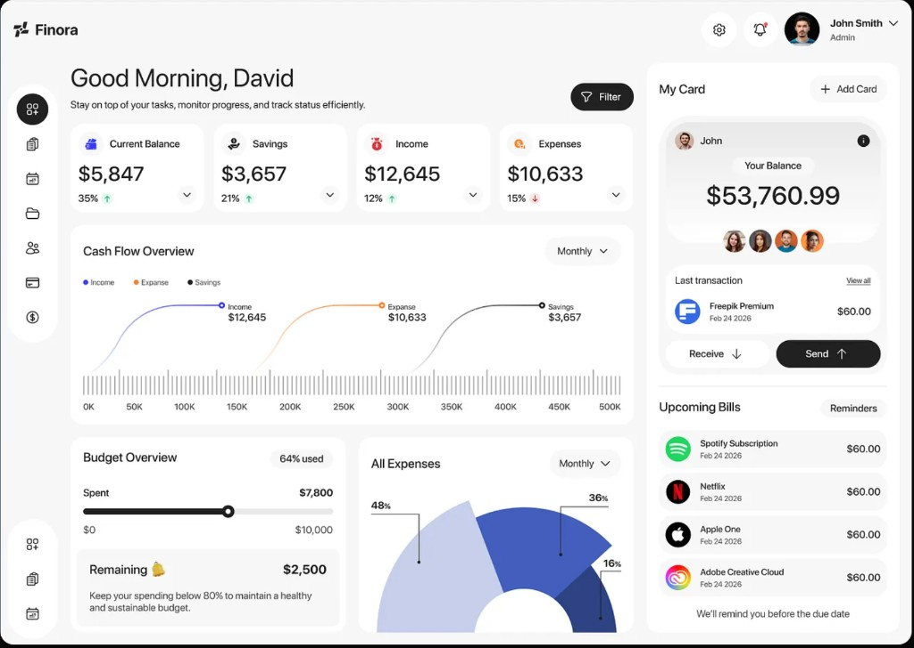

# UI design reference

Canonical look for every screen:

Cursor must follow `.cursor/rules/design-ui.mdc` plus ISO 9241-110 / 9241-125 / 9241-171, ISO/IEC 25010 (UI aesthetics), WCAG 2.2 AA (ISO/IEC 40500).

**Layout:** gray canvas. Transparent header (logo + profile, no card). Floating pill sidebar (not full height) with icon and named views. White 24px cards in the main area.

**Not this:** Common Projects / Dribbble catalog (cream, serif, sparse fashion site). That reference is retired.
