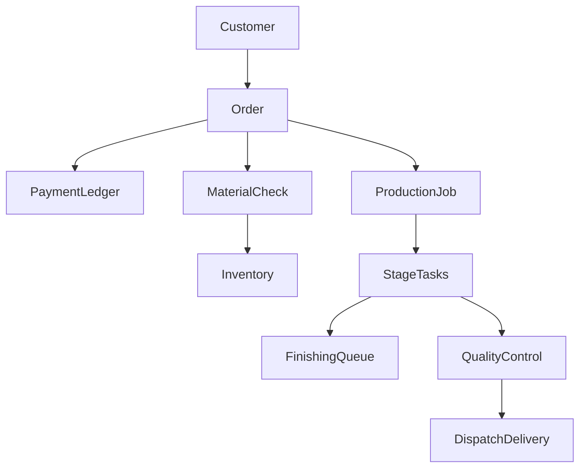

# MVP Implementation Plan Documents

## What this is (and is not)

This is **not** building the shoe system. After you confirm, the only work is writing:

- [`docs/MVP-DISCOVERY-QUESTIONS.md`](docs/MVP-DISCOVERY-QUESTIONS.md) — answered discovery Q&A
- [`docs/MVP-IMPLEMENTATION-PLAN.md`](docs/MVP-IMPLEMENTATION-PLAN.md) — implementation plan for the Section 35 MVP

Source of truth for product scope: [Shoe Manufacturing & Business Management System — Project Requirements & Business Workflow.md](Shoe%20Manufacturing%20%26%20Business%20Management%20System%20%E2%80%94%20Project%20Requirements%20%26%20Business%20Workflow.md) (Section 35 MVP, Section 33 business rules). Catalog look from [`work_materials.txt`](work_materials.txt) applies to product/catalog screens only.

## Locked decisions

### Product and scope

- **MVP:** Full Section 35 first release — auth, roles, customers, measurements, products/designs, orders, inventory, material requirements, production workflow, task assignment, finishing queue, QC, delivery, payments, basic dashboard, basic reports, audit logs.
- **Form:** Internal web app plus **phone-friendly shop-floor screens**. Shared **phone/tablet per station** (not one device per worker). Not a native app.
- **Out of MVP:** advanced color wheel, AI design, full e-commerce, customer self-service, academy, forecasting, multi-branch, advanced accounting, courier APIs, WhatsApp intake, payment gateways.

### Team, stack, deploy

- **Team / time:** Solo or small team, **timeline flexible**. Plan a **phased build** inside the full MVP (demoable increments, no hard go-live date).
- **Stack:** **Next.js, Prisma, PostgreSQL** (your choice).
- **Deploy:** You deploy yourself. The plan will list app/DB/file requirements, not a locked host (Railway/Fly/etc.).
- **Budget / paid extras:** Defer; connect later. Architecture should not depend on SMS or a specific vendor.

### Shop operations

- **Location:** One workshop, one stock location.
- **Volume:** About **20–50 orders per week**.
- **Stages:** Pattern → Cutting → Stitching → Lasting → Filling → Sole → Finishing → QC, but **products may skip stages**.
- **Orders:** Mixed products/sizes on one order; **one worker per stage per item** (no split quantity across workers in MVP).
- **Intake:** Staff **type orders in** (walk-in / WhatsApp / phone stay outside the app).
- **Delivery:** Own riders **and** customer pickup. No third-party couriers.

### Users

- **Month-1 logins:** Owner, manager, sales, production manager, inventory, QC, plus production / finishing / delivery workers on phones.
- **Apprentices:** No separate role — they are **workers**.
- **Customers:** No customer login. Status updates via **in-app or email only** (staff-facing in-app; email to customer). No WhatsApp/SMS in MVP.

### Money and overrides

- **Payments:** Staff record cash / transfer / POS. No Paystack/Flutterwave.
- **Deposit:** Production **may start with no deposit** if **owner or manager** overrides.
- **Overrides:** Owner **and** manager may override “no materials” and “balance not paid”. Overrides are audited.

### Inventory, QC, finishing

- **Reservation:** Availability check **and reserve stock on confirm**.
- **Waste:** Log at **issue** and at **stage complete**.
- **QC:** Cutting, stitching, lasting, **and** final QC.
- **Finishing:** Own **finishing queue/dashboard** (not only a generic stage).
- **Units:** Simple units only (pairs, pieces, metres, ml). **No conversions**.

### Pilot

- **Parallel run:** **2–4 weeks** beside notebooks.
- **Week-1 questions that must work:** Where is the order, who is working on it, which are overdue, what is ready for delivery. Materials/low-stock and the rest of Section 39 come in later increments.

### Still assumed (not asked)

- Auth: email + password; staff accounts created by owner/manager.
- Online-only (no offline-first).
- English UI, ₦ Naira, Africa/Lagos timezone.
- Photos for products, measurements, QC via object storage; you wire hosting later.
- Procurement in MVP: shortage list + purchase request; goods-in as a purchase inventory transaction (not full PO suite).
- Operations UI follows `docs/design/ui-reference.png` (Finora-style dashboard).

## What the implementation plan document will contain

1. **Goal and non-goals** — full Section 35 MVP; exclusions above.
2. **Users and permission matrix** — desktop vs shared-station phone screens per role.
3. **Architecture** — Next.js + Prisma + PostgreSQL; deploy-yourself notes; audit log on mutations; email for customer status.
4. **Domain model** — Order as root; Section 34 entities in MVP (exclude training courses/lessons). Stage templates per product so stages can be skipped.
5. **Build increments** (flexible calendar; solo/small team):
   - Increment 1: auth, roles, customers, measurements, products, orders, payment ledger, basic dashboard (week-1 owner questions for order location / overdue / ready-for-delivery as far as data allows)
   - Increment 2: inventory, transactions, BOM, reserve-on-confirm, shortage, low-stock
   - Increment 3: production jobs/stages (skippable), task assignment, shared-station worker queues, finishing queue
   - Increment 4: multi-stage QC, defects, rework, waste at issue and stage complete
   - Increment 5: dispatch/delivery (riders + pickup), reports, audit completeness, email status, hardening
6. **Screen list** — sales order capture; manager production board; station “queue for this stage”; finishing queue; QC checklists; delivery.
7. **Business rules** — Section 33 plus deposit-override and materials-override by owner/manager, all audited.
8. **Data, backups, self-deploy checklist.**
9. **Pilot** — 2–4 weeks parallel; week-1 vs end-of-MVP success metrics.
10. **Risks** — MVP size vs solo/small team; shared devices; network; inventory accuracy at go-live.
11. **Later** — WhatsApp, payment gateway, offline, public catalog, academy, unit conversions, courier APIs.

## After you confirm

Only those two markdown files are created. No app scaffolding until you later ask to build.
